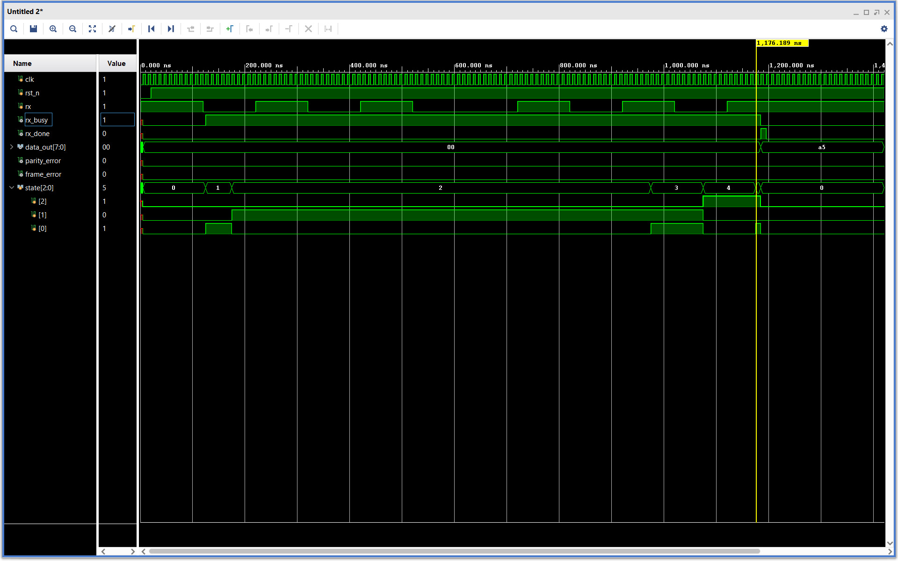
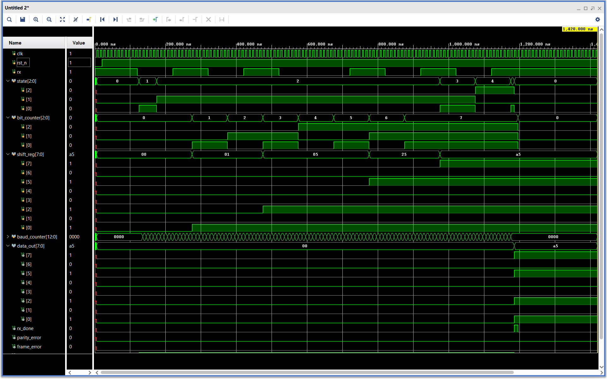
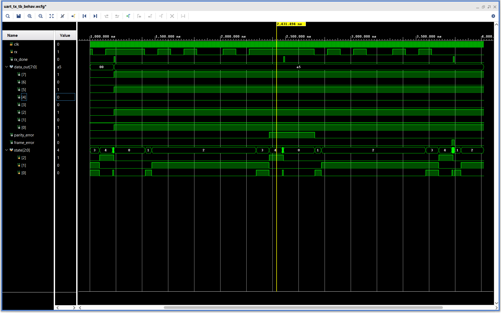
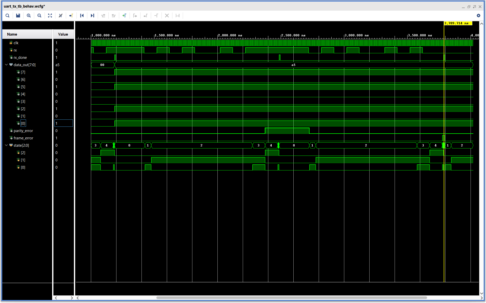

# UART Receiver in Verilog

A parameterized UART (Universal Asynchronous Receiver Transmitter) Receiver designed in Verilog HDL with configurable baud rate and parity support.

---

## Features

- Configurable clock frequency
- Configurable baud rate
- Optional parity support
- Even/Odd parity selection
- Parity error detection
- Frame error detection
- FSM-based implementation
- Parameterized design
- Verilog testbench and waveform verification

---

## FSM

```text
IDLE → START → DATA → PARITY → STOP → DONE → IDLE
```

---

## Project Structure

```text
uart-rx-verilog
├── rtl
├── tb
├── waveforms
├── README.md
├── LICENSE
└── .gitignore
```

---

## Simulation Results

### Correct Reception of `8'hA5`



### Internal Operation of UART Receiver



### Parity Error Detection



### Frame Error Detection



---

## Tools Used

- Verilog HDL
- Xilinx Vivado 2025.1

---

## Future Improvements

- Configurable data bits
- Configurable stop bits
- Oversampling-based receiver
- FIFO buffering
- FPGA implementation

---

## Author

**Piyush Priyaranjan**
Electronics and Telecommunication Engineering | Aspiring VLSI Design Engineer